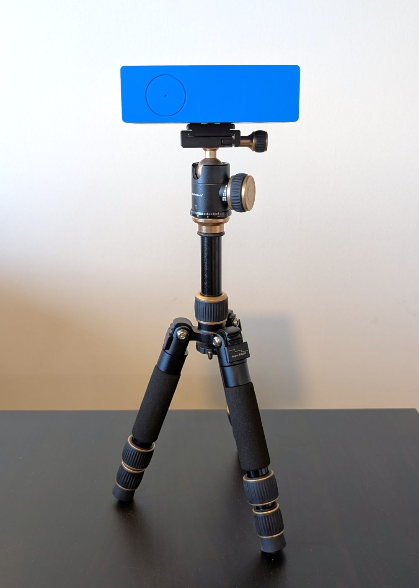
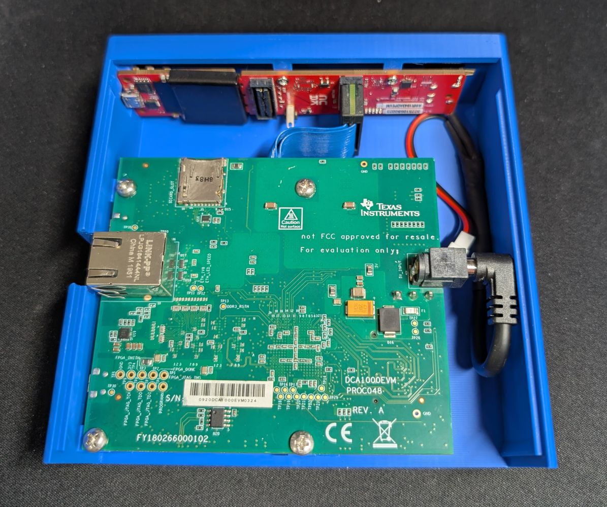
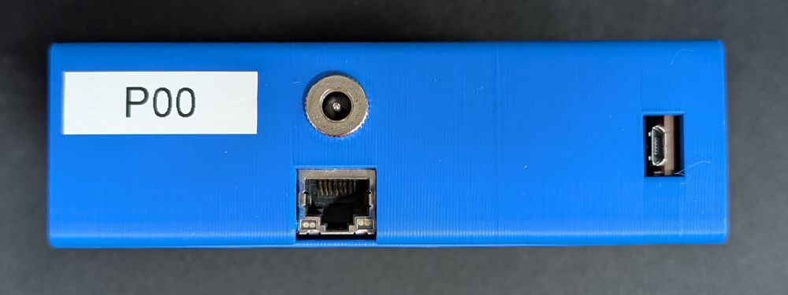
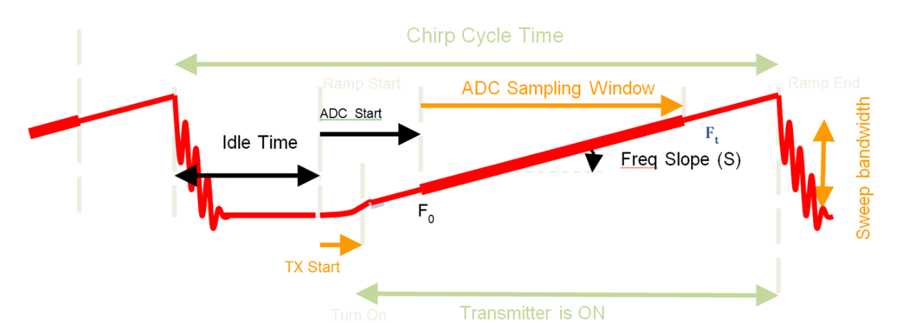

# Radar Lab

This lab provides an introduction to mmWave radar systems, and covers all of the essential skills for working with mmWave radar systems. In this lab, you will:

1. Set up a radar development kit
2. Design a modulation scheme
3. Capture and process radar data
4. See how motion affects radar measurements

!!! info "Report Template"

    Please use [this template](https://docs.google.com/document/d/1G79DNzzjv6U89gqMVlvMjhVO6Dp2uxdTos6liQZTzk0/edit?usp=sharing) for your lab report.

    *Looks familiar? For anyone who has worked for Google/Alphabet, the report is modeled after a Google design document!*

## Set up the Radar

### About the Development Kit

<div style="display: flex; gap: 1em; flex-wrap: wrap;">
  
  
</div>

The development kit is a mmWave FMCW radar system consisting of a [TI AWR1843AOPEVM](https://www.ti.com/tool/AWR1843AOPEVM) radar (red PCB) and a [TI DCA1000EVM](https://www.ti.com/tool/DCA1000EVM) radar capture card (green PCB).

- The radar has 3 transmit and 4 receive antennas, with I/Q output for each receive antenna. The circle on the front of the radar indicates the approximate center of the antenna array.
- The frequency of the radar is 77 GHz, and can operate in the 76-81 GHz range, though individual chirps can cover at most 4 GHz.
- The capture card is capable of real-time streaming of the raw I/Q data from the radar.

These components have been integrated into a 3D-printed enclosure for you; you should not need to open or otherwise modify the unit.

!!! danger

    The radar and capture card are sensitive to electrostatic discharge (ESD). Please do not open the enclosures!

!!! tip

    The enclosure has a standard 1/4-20 tripod mount on the bottom.

??? quote "Bill of Materials"

    | Part | Qty | Description |
    | --- | --- | --- |
    | `shell.STL`; PLA/PETG, standard print quality | 1 | Top shell of the enclosure, with mounting points for each component |
    | `bottom.STL`; PLA/PETG, standard print quality | 1 | Bottom plate with 1/4-20 inserts for tripod attachment |
    | [TI AWR1843AOPEVM](https://www.ti.com/tool/AWR1843AOPEVM) | 1 | Radar sensor |
    | [TI DCA1000EVM](https://www.ti.com/tool/DCA1000EVM) | 1 | Radar capture card |
    | [Samtec HQCD-030-06.00-TEU-SEU-1 Coaxial Ribbon Cable](https://www.digikey.com/en/products/detail/samtec-inc/hqcd-030-06-00-teu-seu-1/6691516) | 1 | Longer version of the cable included with the DCA1000EVM |
    | [5.5x2.1mm DC Jack Panel Mount, 12mm diameter](https://www.amazon.com/Tugermoola-Threaded-Female-Connector-Adapter/dp/B0DP6MNQQB) | 1 | Power input for the DCA1000EVM | 
    | [5.5x2.1mm DC Jack 90 degree](https://www.amazon.com/10-Pack-Connectors-Monitors-Surveillance-Security/dp/B0G4R6M31D) | 1 | Power input for the DCA1000EVM |
    | M2.5x5mm screw | 2 | Mounting the AWR1843AOPEVM to the shell |
    | M3x5mm screw | 4 | Mounting the DCA1000EVM to the shell |
    | M3x8mm screw | 1 | Attaching the bottom plate |
    | M3x5x4 heat set insert | 1 | Installed in the top shell |
    | 1/4-20 heat set insert | 1 | Installed in the bottom plate |

### Setting up the Development Kit

{ width="500" }

The radar unit has 3 ports on the side:

- Ethernet port for I/Q data output; this can be connected to any ethernet-capable (1000BaseT) port on your computer.
- USB 2.0 Micro B port for issuing commands to the radar; this can be connected to any USB port on your computer, including ports on hubs or docks.
- DC jack for power input. This takes 5v, and can consume up to 2A.

    !!! danger

        You should generally only use the provided power supply.

        While it theoretically possible to power the unit from a USB port via a USB to DC jack cable, the required peak current exceeds the USB 3.0 (and definitely 2.0) specifications. If your computer has faulty current limiting circuits, this could damage your computer!

Connect these ports as appropriate. Then, follow the instructions in the [`xwr` user guide](https://radarml.github.io/xwr/usage/) to set up your computer.

!!! note

    The [hardware setup](https://radarml.github.io/xwr/setup/) steps have already been done for you. The `xwr` demo should also auto-detect the port to which the radar is connected.

!!! tip

    The development kit uses the AWR1843AOP (i.e., uses the AWR1843 radar silicon, but has the AWR1843AOP antenna configuration). When running the demo, this means you should specify
    ```
    --device AWR1843 --rsp AWR1843AOP
    ```

If everything has been set up correctly, you should be able to clone the [`xwr` repo](https://github.com/RadarML/xwr) and run the [`xwr` demo](https://radarml.github.io/xwr/usage/#run-the-demo).

!!! note

    If this is as far as you get with the physical hardware, please submit a picture or screenshot of the demo running (if you are able to complete any data collection & visualization, we will assume you were able to set up your radar kit).

## Configure the Radar

!!! tip

    You may find our [FMCW radar cheatsheet](https://github.com/RadarML/radar-cheatsheet/releases/download/v1.0/radar_cheatsheet.pdf) to be useful for this lab.

### Determine Requirements

In this lab, you will need to collect and visualize data captured with a moving and static sensor and targets.

1. What targets do you plan to capture? At what speeds and distances will they be?
2. How do you plan to move the sensor? At what speed will you move it?

Document these requirements in your lab report (e.g., "the radar should be able to accurately determine the speed of targets moving at up to 5 m/s").

### Design the Modulation

Once you have determined these requirements, you can proceed to design your modulation by selecting appropriate values for each [configuration parameter](https://radarml.github.io/xwr/system/#xwr.XWRConfig).

!!! tip

    The RadarML [Radar Cheatsheet](https://github.com/RadarML/radar-cheatsheet/releases/download/v1.0/radar_cheatsheet.pdf) provides a quick-reference manual for FMCW radar equations, and may be useful for designing your modulation.



In addition to the [hardware constraints](https://radarml.github.io/xwr/constraints/) which must be satisfied, your modulation must meet the following requirements:

1. The modulation must operate at a target framerate of 10fps.
2. The modulation must have at least 32 range and Doppler bins.
3. The modulation must provide the best possible range resolution, given the hardware constraints, the previous constraints, and the maximum range/velocity requirements.
4. The modulation must provide the best possible Doppler resolution, given the hardware constraints, the previous constraints, and the maximum range/velocity requirements.

In your lab report, justify your modulation design choices. In particular, you should demonstrate how your configuration meets each of the requirements using a calculation based on the FMCW radar equations.

!!! note

    You do not need to justify why your parameters meet the [hardware constraints](https://radarml.github.io/xwr/constraints/); if you violate these constraints, the radar system will not work, and you will not be able to collect any data.

## Collect Data Samples

Using the `xwr` [high level API](https://radarml.github.io/xwr/system/), create a data capture system (e.g., a python script which streams from the API and saves the output). The exact structure and features of this system are up to you; some things to consider:

- You can use the demo script as a starting point if you would like. Note that it may be useful to include live preview functionality to visualize the data as it is being captured.
- How do you plan to trigger data capture? You might consider a button press, timer, or always recording when the script is running.
- You can use any data format; we typically save directly in binary formats, though containers such as `.npy`, `.npz`, `.h5`, etc. may be more convenient (albeit at the cost of some overhead).

In your report, describe key design decisions you made for your data capture system. Provide the rationale behind each decision (convenience and ease of implementation is a valid rationale!). You should document at least three decisions.

Using this system, then collect samples under these four conditions:

- Static sensor, static targets
- Static sensor, moving target(s)
- Moving sensor, static targets
- Moving sensor, moving target(s)

## Signal Processing

`xwr` includes a powerful signal processing library; however, this library is quite abstract, and includes several layers of indirection to support features such as different radars and numerical backends which make it hard to read. Your job is to write a standalone implementation of the signal processing pipeline for the AWR1843AOP and your modulation.

### Requirements

Your implementation should be able to do the following:

- Compute (complex) 4D range-Doppler-azimuth-elevation data cubes from the data collected by the AWR1843AOP.
    - Since the AWR1843AOP has only 3 antennas in the azimuth and 4 in the elevation axes, you should zero-pad these axes to at least 32 bins.
- Compute cell-averaging CFAR peaks.
    - First flatten the 4D range-Doppler-tx-rx data cube into a 2D range-Doppler heatmap.
    - Choose reasonable CFAR parameters; you can play with these parameters to see what provides the best (qualitative) balance between noise and sensitivity.
    - You are free to choose other CFAR variants (e.g., CFAR-CASO) if you wish. If you do so, make sure to explicitly state this in your report.
- Compute angle estimates (azimuth and elevation) for the detected peaks, and convert the range-azimuth-elevation CFAR points to Cartesian coordinates.
    - You can use a brute-force approach to compute angles by calculating the azimuth-elevation FFT with a large amount of zero-padding, and finding the bin with maximum magnitude.

!!! warning

    The data output of the TI capture card (and by extension, `xwr`, which faithfully captures the raw outputs) is in a nonstandard byte order; you can call into [`xwr.rsp.iq_from_iiqq`](https://radarml.github.io/xwr/rsp/#xwr.rsp.iq_from_iiqq) to convert the raw bytes into complex numbers.

### Non-requirements

To make your job easier, your implementation explicitly does not have to do the following:

- Be written independently. It is perfectly fine to refer to the `xwr` source code for guidance. You can even set up a parity test if you'd like!
- Be a python library; your implementation can be a script, module, or even part of a Jupyter notebook.
- Support different radars or chirp/modulation configurations other than the one you selected.
- Use GPU acceleration or backends other than numpy, or implement any performance optimizations (though a grossly inefficient implementation, e.g., using python scalars and lists instead of arrays, may adversely impact your ability to complete this lab even within the generous time frame provided).

You are of course free and encouraged to attempt these if you wish!

## Visualize Data

Using your signal processing implementation, generate the following for a sample frame from each setting:

- Range-Doppler heatmaps
- Range-azimuth heatmaps
- Bird's eye view of the detected points in Cartesian coordinates

!!! info

    Make sure that heatmaps use a color mapping which makes the data easily interpretable. As a hint, when using standard colormaps (e.g., matplotlib `viridis`), you can apply transformations to the data prior to plotting, e.g. `sqrt`, `log`, and/or clipping by the 99th percentile.

Then, answer the following questions:

- What happens to the radar measurements when there is motion in the scene?
- What happens to the radar measurements when the sensor moves?
- What happens if an object exceeds the maximum design range of the radar?
- What happens if an object exceeds the maximum design velocity of the radar?

## Grading and Submission

### Submission Checklist

Your submission should include a lab report along with your code and (if requested) data. Make sure you have included:

- Your lab report, including each visualization
- The data capture system code
- The signal processing implementation code

### Rubric

!!! warning

    Submission of the lab report and code are prerequisites to receiving credit for any component of this lab! 

| Component | Weight |
|-----------|--------|
| Development kit setup | 25% |
| Modulation design | 25% |
| Signal processing implementation | 25% |
| Data samples and visualizations | 25% |
